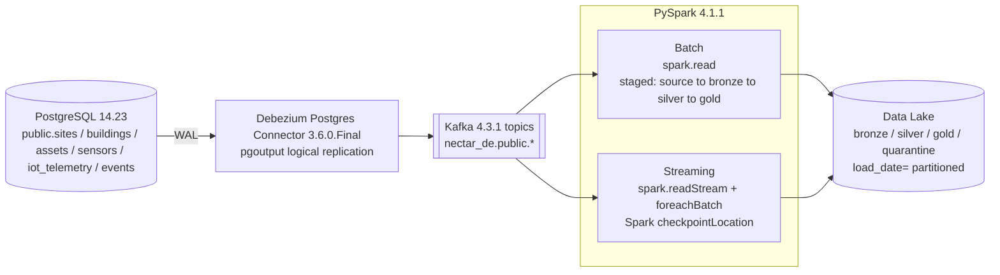
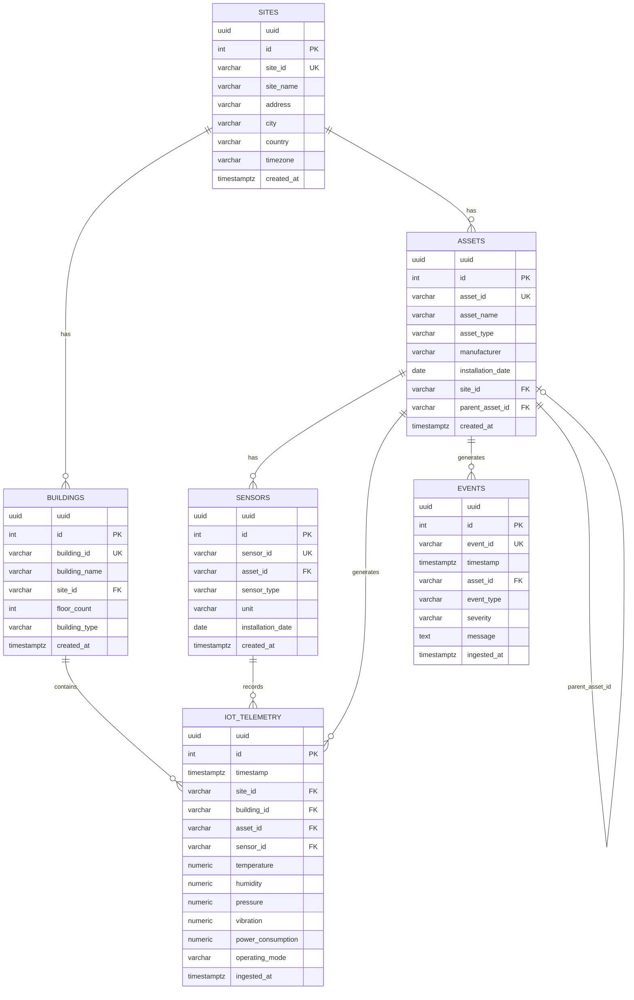

# SwarmPipe

SwarmPipe ingests, processes, and serves telemetry data from thousands of IoT devices deployed across multiple connected-building customer sites (asset/sensor metadata, energy, environment, and fault events), supporting both batch and real-time analytics.

## Tech stack & versions

| Component | Version |
|---|---|
| Python | 3.10.12 |
| PostgreSQL | 14.23 |
| Debezium PostgreSQL connector | 3.6.0.Final |
| Apache Kafka (broker + Connect, standalone mode) | 4.3.1 |
| Apache Spark / PySpark | 4.1.1 (Scala 2.13) |
| spark-sql-kafka-0-10 | 4.1.1 |
| Delta Lake (delta-spark, JVM + Python) | 4.1.0 |
| Storage | Local filesystem data lake (`DATA_LAKE_PATH`) — Parquet for bronze + batch silver/gold, Delta for streaming silver/gold |

---

## Task 1 — Data Architecture Design

### Architecture



### Component selection rationale

- **Debezium (CDC) over polling** — reads directly off the Postgres WAL (`pgoutput`, `nectar_publication` / `nectar_slot`), so ingestion adds no query load on the source database and captures every row change, not periodic snapshots.
- **Kafka as the decoupling layer** — batch and streaming consumers read the same topics independently without going back to Postgres; each table gets its own topic (`nectar_de.public.<table>`, via `topic.prefix`).
- **PySpark for both batch and streaming** — one engine, one set of transformation formulas (`etl/helpers/calculation_helper.py`) reused by both paths instead of two parallel implementations.
- **Delta Lake for the streaming sink** — streaming needs row-level upsert (`MERGE`), which plain Parquet can't do; Delta adds that on top of Parquet without introducing a separate storage system.
- **Local filesystem data lake** — driven entirely by `DATA_LAKE_PATH`. `SparkSessionFactory` has no `hadoop-aws` jar and no `fs.s3a.*` credentials/config wired up, so pointing `DATA_LAKE_PATH` at `s3a://...` today would fail outright ("No FileSystem for scheme: s3a") — moving to S3 needs real code changes (add the hadoop-aws package, wire up credentials), not just an env var swap.

### Design assumptions

- `operating_mode == 'running'` is the only value counted as active time for `daily_utilization` — confirmed directly, since `operating_mode` has no DB-level `CHECK` constraint (unlike `event_type`/`severity`) so its vocabulary isn't self-documenting.
- Kafka messages are Debezium's default JSON envelope (`{"before":..., "after":..., "op":...}`) with `schemas.enable=false`; the pipeline reads out `after.*` only — delete events (`op:"d"`, `after: null`) aren't specifically handled downstream.
- Batch and streaming are assumed to run against **disjoint entities at any given time** — see Known Limitations for why running both against the same entity isn't safe yet.
- `decimal.handling.mode=double` is required on the connector — Debezium's default (`precise`) base64-encodes Postgres `NUMERIC` columns, which silently broke every numeric aggregation (`power_consumption`, `temperature`, etc.) until this was set.

### Scalability considerations

- Kafka partitioning lets both batch and streaming consumers scale horizontally per topic. The current dev setup runs single-node (`local[1]`) for simplicity — `spark.master` / `spark.executor.memory` / `spark.sql.shuffle.partitions` in `SparkSessionFactory.create_spark_session()` are the knobs to raise for a real cluster (`local[1]` → `yarn`/`k8s`).
- Streaming's `checkpointLocation` (a genuine Spark checkpoint, one per `{model}_{entity}`) is what lets a stream be killed and restarted without reprocessing or dropping messages, and is the basis for scaling a given entity's consumer independently.
- Batch source extraction currently re-reads the whole Kafka topic every run rather than tracking offsets between runs — fine at current volume, but doesn't scale as topic history grows (see Known Limitations).

### Fault tolerance / monitoring

- **Data quality gate**: every batch/stream write splits into `clean` vs `quarantine` (`dropna(how='any')` + `exceptAll`) before landing in Silver — bad records never silently corrupt downstream tables, they land in `quarantine/{model}_{entity}/load_date=.../` instead.
- **Idempotency**: streaming upserts are Delta `MERGE`s keyed on business keys, so if Spark reprocesses a micro-batch after a crash (checkpoint replay), re-applying the same values is a no-op rather than a duplicate.
- **Monitoring**: currently `print()`-based step logging only — no metrics/alerting wired up yet (flagged as a gap below).

---

## Task 2 — Build a Data Pipeline

### Data ingestion

- **Batch** (`etl/batch/Extract.py:extract_from_source`) — `SparkSessionFactory.read_batch_topic_messages` does a bounded `spark.read` over the entity's topic (`startingOffsets=earliest`), parses the Debezium `after` JSON against `entity_schema`, writes the raw result to Bronze as-is.
- **Streaming** (`etl/streaming/Extract.py:extract_from_source`) — `read_stream_topic_messages` opens a continuous `spark.readStream`, same JSON parsing, feeds into `.writeStream.foreachBatch(...)` on a 10-second trigger.

### Data validation

Both paths run the same two checks (`Transformations.dedup_null_check` in batch, inline in `StreamTransformations.upsert` for streaming):

- **Duplicate records** — `dropDuplicates()` on the full row.
- **Missing values** — `dropna(how='any')`; any row with a null in any column is routed to quarantine (`dedup_df.exceptAll(clean_df)`) instead of Silver.

Not yet implemented from the challenge's validation list: invalid timestamps, invalid asset IDs, outlier detection, late-arriving-data handling (streaming does route late fact records to the correct historical `load_date` partition — see Task 3 — but doesn't flag them as "late" for monitoring purposes).

### Data transformation (curated Gold tables)

All four formulas live once in `etl/helpers/calculation_helper.py` and are reused by both batch (`batch/Transform.py:gold_transformation`) and streaming (`streaming/Transform.py:_upsert_fact`):

| Challenge requirement | Implementation | Grain |
|---|---|---|
| Hourly energy consumption | `CalculationHelper.hourly_energy` — `sum(power_consumption)` | `site_id, building_id, asset_id, hour` |
| Average environmental conditions | `CalculationHelper.hourly_environment` — `avg(temperature/humidity/pressure/vibration)` | `site_id, building_id, asset_id, hour` |
| Daily asset utilization | `CalculationHelper.daily_utilization` — `count(operating_mode='running') / count(*) * 100` | `site_id, building_id, asset_id, day` |
| Fault statistics per asset | `CalculationHelper.daily_faults` — count + High/Medium/Low breakdown, filtered to `event_type='Fault'` | `asset_id, day` |

### Data aggregation (site/building/asset-level metrics)

The Gold grain above already carries `site_id`/`building_id`/`asset_id` together, so site- or building-level metrics are one more `groupBy`/`sum` on top of the existing asset-level Gold tables — not materialized as separate Gold tables yet (see Known Limitations).

### Pipeline commands

**Batch** — three explicit staged runs per entity (each is a separate process that starts and finishes):

```bash
python3 -m etl.app --action batch --operation extract   --layer source --model dim  --entity assets
python3 -m etl.app --action batch --operation transform --layer silver --model dim  --entity assets
python3 -m etl.app --action batch --operation transform --layer gold   --model dim  --entity assets

python3 -m etl.app --action batch --operation extract   --layer source --model fact --entity iot_telemetry
python3 -m etl.app --action batch --operation transform --layer silver --model fact --entity iot_telemetry
python3 -m etl.app --action batch --operation transform --layer gold   --model fact --entity iot_telemetry
```

**Streaming** — one long-running process per entity; a single command does extract + Silver upsert + Gold recompute continuously (`query.awaitTermination()` blocks until killed):

```bash
python3 -m etl.app --action stream --operation extract --layer source --model dim  --entity assets
python3 -m etl.app --action stream --operation extract --layer source --model fact --entity iot_telemetry
```

---

## Task 3 — Data Modeling

### Dimension tables (`dim_*`)

| Table | Business key | Source |
|---|---|---|
| `dim_sites` | `site_id` | `public.sites` |
| `dim_buildings` | `building_id` | `public.buildings` |
| `dim_assets` | `asset_id` | `public.assets` |
| `dim_sensors` | `sensor_id` | `public.sensors` |

### Fact tables (`fact_*`)

| Table | Grain | Source |
|---|---|---|
| `fact_iot_telemetry` | one row per sensor reading | `public.iot_telemetry` |
| `fact_events` | one row per operational event | `public.events` |
| `fact_hourly_energy` (Gold, derived) | site + building + asset + hour | aggregated from `fact_iot_telemetry` |
| `fact_hourly_environment` (Gold, derived) | site + building + asset + hour | aggregated from `fact_iot_telemetry` |
| `fact_daily_utilization` (Gold, derived) | site + building + asset + day | aggregated from `fact_iot_telemetry` |
| `fact_daily_faults` (Gold, derived) | asset + day | aggregated from `fact_events`, filtered to `event_type='Fault'` |

### ER diagram



Full DDL: [`schema_details.txt`](./schema_details.txt).

### Partitioning strategy

- Every layer (`bronze` / `silver` / `gold` / `quarantine`) is Hive-style partitioned on disk by `load_date=YYYYMMDD` (`etl/batch/Load.py`, `etl/streaming/Load.py`).
- **Batch**: `load_date` = the date the *pipeline ran* (`datetime.now()` in `app.py`) — a run's output lands in one partition, fully overwritten (`mode("overwrite")`) each time.
- **Streaming**: for fact tables, `load_date` is derived from **the record's own `timestamp`**, not "today" — so a late-arriving or corrected reading is upserted into the historical partition it actually belongs to (`upsert_silver_partition` / `upsert_gold_partition` in `etl/streaming/Transform.py`), never overwritten wholesale.
- Gold facts are further bucketed within each `load_date` by `hour` (`hourly_energy`, `hourly_environment`) or `day` (`daily_utilization`, `daily_faults`), computed via `date_trunc('hour', ...)` / `to_date(...)` in `CalculationHelper`.

### Indexing / lookup strategy

Parquet/Delta don't have traditional indexes; the practical equivalent here is the partition column plus each table's declared business/merge key — both batch (`entity_mapper`) and streaming (`merge_keys`, in `etl/constants/constants.py`) are built around fast lookup and upsert by that key:

- Dims: `asset_id` / `site_id` / `building_id` / `sensor_id`
- `iot_telemetry`-derived Gold facts: `site_id, building_id, asset_id` (+ hour/day)
- `events`-derived Gold facts: `asset_id` (+ day)

Delta tables (streaming sinks) also get file-level min/max column statistics for free from the Delta transaction log, which Spark uses to skip files on filters against those columns — a practical substitute for a manual index.

---

## Task 4 — Multi-Asset Hierarchy & Connectivity

Assets form a parent/child hierarchy via the self-referencing `parent_asset_id` column on `assets` (e.g. `Chiller-01` → `AHU-01`, `AHU-02`). Modeled relationally (not graph-DB) — a self-join on `dim_assets` is sufficient at this scale.

### Retrieve parent and child assets (Flink SQL)

```sql

CREATE TABLE dim_assets (
    asset_id         STRING,
    asset_name       STRING,
    asset_type       STRING,
    site_id          STRING,
    parent_asset_id  STRING
) WITH (
    'connector' = 'filesystem',
    'path'      = 'file:///data_lake/gold/dim_assets',
    'format'    = 'parquet'
);

CREATE TABLE dim_customer_site (
    customer_id    STRING,
    customer_name  STRING,
    site_id        STRING,
    site_name      STRING
) WITH (
    'connector' = 'filesystem',
    'path'      = 'file:///data_lake/gold/dim_customer_site',
    'format'    = 'parquet'
);

SELECT
    cust.customer_id,
    cust.customer_name,
    cust.site_id,
    cust.site_name,
    child.asset_id     AS child_asset_id,
    child.asset_name   AS child_asset_name,
    child.asset_type   AS child_asset_type,
    parent.asset_id    AS parent_asset_id,
    parent.asset_name  AS parent_asset_name,
    parent.asset_type  AS parent_asset_type
FROM dim_assets AS child
LEFT JOIN dim_assets AS parent
    ON child.parent_asset_id = parent.asset_id
JOIN dim_customer_site AS cust
    ON child.site_id = cust.site_id
ORDER BY cust.site_id, parent.asset_id, child.asset_id;
```

**Real vs. imagined:** `dim_assets` matches the actual gold table (`asset_id`, `parent_asset_id`, `site_id`, ...). `dim_customer_site` is fictional — the real gold table is `dim_sites` (`site_id`, `site_name`, no customer fields); swap the CTE for `dim_sites` and drop the `customer_id`/`customer_name` columns to run this against what actually exists today. The self-join (`child.parent_asset_id = parent.asset_id`) is the core mechanic and doesn't depend on either version of the site table.

Not yet implemented from Task 4: "retrieve all assets under a site," "find downstream impacted assets," "identify orphan/disconnected assets," and the NetworkX/Neo4j bonus — this section only covers the parent/child query that was asked for.

---

## Task 6 — SQL Challenge

Most of these run against the Gold tables already built (`fact_hourly_energy`, `fact_daily_utilization`, `fact_daily_faults`, `dim_assets`, `dim_sites`). #4 and #5 need row-level timestamps that no Gold aggregate carries, so those run against raw Silver `fact_iot_telemetry` instead — flagged inline.

```sql
-- ============================================================
-- 1. Top 10 assets with the highest energy consumption
--    Source: fact_hourly_energy (Gold), dim_assets (Gold)
-- ============================================================
SELECT
    a.asset_id,
    a.asset_name,
    SUM(e.total_power_consumption) AS total_energy_consumption
FROM fact_hourly_energy e
JOIN dim_assets a ON a.asset_id = e.asset_id
GROUP BY a.asset_id, a.asset_name
ORDER BY total_energy_consumption DESC
LIMIT 10;


-- ============================================================
-- 2. Average daily energy consumption for each site
--    fact_hourly_energy is hourly grain, so roll up to daily
--    per site first, then average across days.
-- ============================================================
WITH daily_site_energy AS (
    SELECT
        site_id,
        CAST(hour AS DATE) AS day,
        SUM(total_power_consumption) AS daily_energy
    FROM fact_hourly_energy
    GROUP BY site_id, CAST(hour AS DATE)
)
SELECT
    s.site_id,
    s.site_name,
    AVG(d.daily_energy) AS avg_daily_energy_consumption
FROM daily_site_energy d
JOIN dim_sites s ON s.site_id = d.site_id
GROUP BY s.site_id, s.site_name
ORDER BY avg_daily_energy_consumption DESC;


-- ============================================================
-- 3. Assets that generated more than 10 faults in the last 30 days
--    Source: fact_daily_faults (Gold) — already filtered to event_type='Fault'
-- ============================================================
SELECT
    a.asset_id,
    a.asset_name,
    SUM(f.fault_count) AS total_faults_last_30_days
FROM fact_daily_faults f
JOIN dim_assets a ON a.asset_id = f.asset_id
WHERE f.day >= CURRENT_DATE - INTERVAL '30 days'
GROUP BY a.asset_id, a.asset_name
HAVING SUM(f.fault_count) > 10
ORDER BY total_faults_last_30_days DESC;


-- ============================================================
-- 4. Assets that have not reported telemetry for the last 24 hours
--    Needs row-level timestamps -> raw fact_iot_telemetry (Silver), not
--    any Gold aggregate. LEFT JOIN from dim_assets so assets with ZERO
--    telemetry ever (not just "stale") are also caught, not silently
--    dropped by an inner join.
-- ============================================================
SELECT
    a.asset_id,
    a.asset_name,
    MAX(t."timestamp") AS last_reported_at
FROM dim_assets a
LEFT JOIN fact_iot_telemetry t ON t.asset_id = a.asset_id
GROUP BY a.asset_id, a.asset_name
HAVING MAX(t."timestamp") IS NULL
    OR MAX(t."timestamp") < NOW() - INTERVAL '24 hours'
ORDER BY last_reported_at NULLS FIRST;


-- ============================================================
-- 5. Hourly utilization for each building
--    Our existing daily_utilization Gold table is asset+day grain, not
--    building+hour -- wrong shape for this question, so computed fresh
--    from raw fact_iot_telemetry using the same 'running' definition
--    (utilization_pct = running readings / total readings * 100).
-- ============================================================
SELECT
    building_id,
    DATE_TRUNC('hour', "timestamp") AS hour,
    COUNT(*) FILTER (WHERE operating_mode = 'running') * 100.0 / COUNT(*) AS utilization_pct
FROM fact_iot_telemetry
GROUP BY building_id, DATE_TRUNC('hour', "timestamp")
ORDER BY building_id, hour;


-- ============================================================
-- 6. Sites with abnormal increases in power consumption
--    "Abnormal" isn't defined in the challenge doc -- using a standard
--    z-score style rule: a day's total consumption is "abnormal" if it
--    exceeds that site's own historical mean by more than 2 standard
--    deviations. This is a reasonable definition chosen for this
--    exercise, not a stated spec.
-- ============================================================
WITH daily_site_energy AS (
    SELECT
        site_id,
        CAST(hour AS DATE) AS day,
        SUM(total_power_consumption) AS daily_energy
    FROM fact_hourly_energy
    GROUP BY site_id, CAST(hour AS DATE)
),
site_stats AS (
    SELECT
        site_id,
        AVG(daily_energy) AS avg_energy,
        STDDEV(daily_energy) AS stddev_energy
    FROM daily_site_energy
    GROUP BY site_id
)
SELECT
    d.site_id,
    s.site_name,
    d.day,
    d.daily_energy,
    st.avg_energy,
    st.stddev_energy
FROM daily_site_energy d
JOIN site_stats st ON st.site_id = d.site_id
JOIN dim_sites s ON s.site_id = d.site_id
WHERE st.stddev_energy > 0
  AND d.daily_energy > st.avg_energy + 2 * st.stddev_energy
ORDER BY d.site_id, d.day;
```

---

## Known limitations (honest gaps, not resolved yet)

1. **Format mismatch between batch and streaming Silver/Gold.** Batch writes plain Parquet (`mode("overwrite")`); streaming writes Delta (`MERGE`) — to the *same* logical path pattern (`silver/{model}_{entity}/load_date=.../`). If both ever targeted the same entity, batch's overwrite would destroy the Delta transaction log streaming depends on. Current assumption is batch and streaming stay on disjoint entities; the real fix is migrating batch Silver/Gold to Delta too.
2. **Batch source extraction has no checkpoint** — it re-reads the entire Kafka topic (`earliest`→`latest`) on every run instead of tracking consumed offsets. Streaming does have a genuine Spark checkpoint (`checkpointLocation`); batch doesn't yet.
3. **Validation covers only dedup + null-check** — invalid timestamps, invalid asset IDs, outlier detection, and late-arrival flagging from the challenge spec aren't implemented.
4. **No site-level/building-level Gold rollups yet** — only asset-grain Gold facts exist; rollups would be a further `groupBy` on the existing asset-level tables.
5. **No monitoring/alerting** beyond `print()` statements per pipeline step.
6. `entity_schema['sensors']` in `constants.py` has a typo (`'id,'` — missing comma) that merges two field names into one string; not fixed as part of this doc update.

---

## Repository layout

```
etl/
├── app.py                       # CLI entrypoint (--action batch|stream)
├── batch/
│   ├── Extract.py               # source→bronze, bronze→silver, silver→gold
│   ├── Transform.py             # dedup_null_check, gold_transformation
│   └── Load.py                  # Parquet writers (bronze/silver/gold/quarantine)
├── streaming/
│   ├── Extract.py                # readStream + foreachBatch wiring
│   ├── Transform.py              # per-micro-batch upsert logic
│   └── Load.py                   # Delta MERGE helpers
├── helpers/
│   └── calculation_helper.py     # shared gold aggregation formulas
├── constants/
│   └── constants.py              # topic_prefix, entity_mapper, entity_schema, merge_keys
└── utils/
    └── SparkSession.py           # SparkSessionFactory (Delta + Kafka config, readers)

kafka_connector_config/
└── postgresql_source_connector.properties   # Debezium connector config
```
